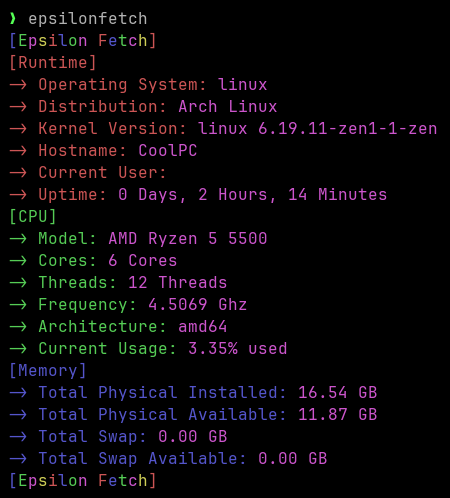

# Epsilon Fetch
A minimalist and cross-platform Fetch Program for displaying Hard- and Software Info written in Go

## Version
Current Version: v1.1.0

## About
Epsilon Fetch is a simple program for displaying System Information on a Console. It is designed to work on all common Operating Systems. 

This Software is licensed under the GPLv3.0 License.

## How to Download, Compile and Run
### Prerequisites
Any OS will work, you just need a Go Compiler installed. If you don't have one downloaded already, visit https://go.dev/

### Download and Compilation
First, clone the Repo
```bash
git clone https://github.com/Moritisimor/EpsilonFetch
```

Then, Change your Working Directory to where the Main Program resides
```bash
cd EpsilonFetch/cmd/epsilonfetch
```

And finally, compile it
```bash
go build -ldflags="-s -w" .
```
The ```-ldflags``` are linker flags and serve to make the compiled binary smaller, but you can leave those out if you want to.

### Execution
Assuming you are still in the cmd directory, you enter ```./epsilonfetch```

Otherwise you simply enter the path of the Executable. On UNIXoid Systems you may need to give it permission to run as a program with ```chmod +x epsilonfetch```.

### Screenshots
EpsilonFetch on Arch Linux


